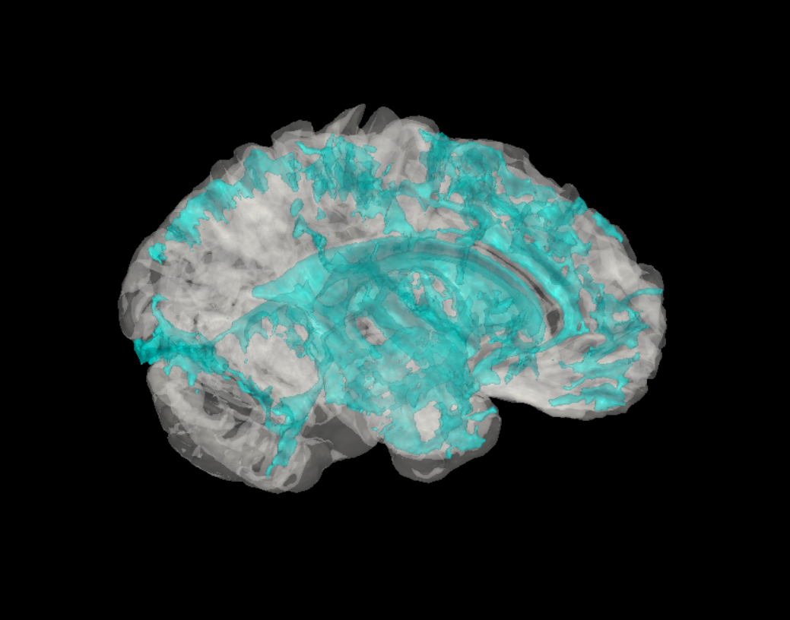
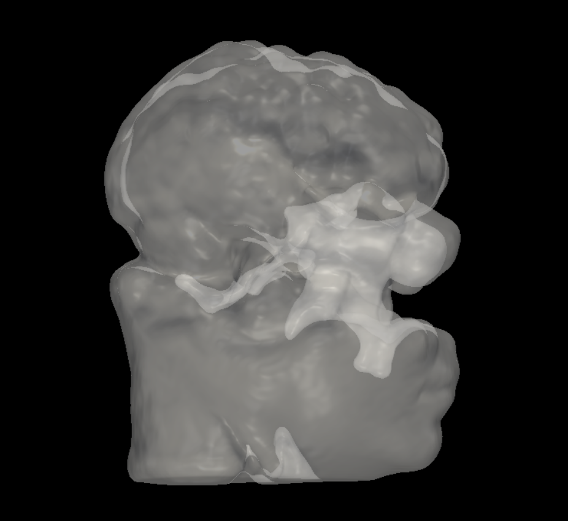
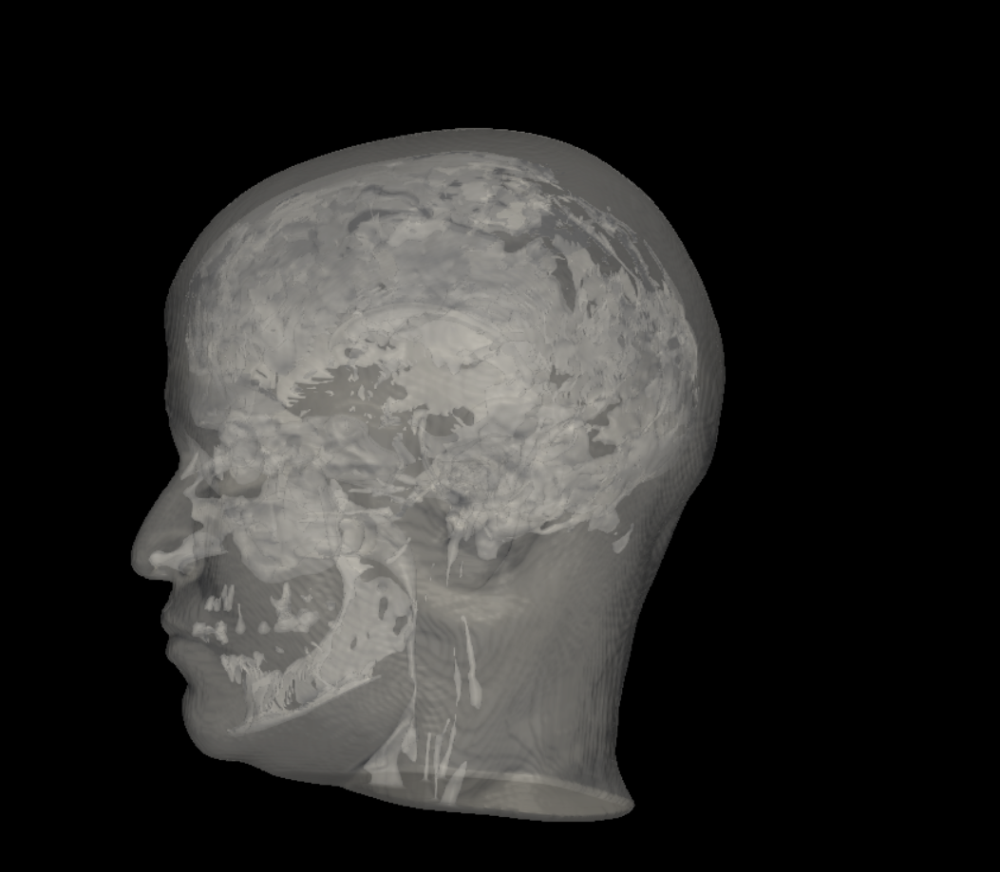

# 🧠 MRI 2D → 3D Brain Reconstruction

**Medical Imaging · DICOM · 3D Reconstruction · Computer Vision · Python**

A research and demonstration project for reconstructing and visualizing a 3D brain surface from 2D MRI DICOM slices.

The project explores the complete workflow from **DICOM processing and volumetric reconstruction to brain segmentation, 3D surface extraction, mesh processing, and interactive visualization**.

> ⚠️ **Research / Demonstration Project**  
> This project is intended for research, education, experimentation, and visualization purposes. It is not clinically validated and must not be used for medical diagnosis or clinical decision-making.

---

## 🎥 Demo

### 🧠 3D Brain Reconstruction



### 🖥️ Interactive 3D Brain Viewer



### 🔬 Surface Reconstruction



---

# 📌 Project Overview

MRI data is commonly acquired as a sequence of 2D cross-sectional images.

This project demonstrates how a collection of MRI DICOM slices can be processed and reconstructed into a **3D volumetric representation and an approximate brain surface model**.

The general workflow is:

```text
2D MRI DICOM Slices
        │
        ▼
DICOM Series Analysis
        │
        ▼
MRI Sequence Selection
        │
        ▼
Geometry-Aware Slice Ordering
        │
        ▼
3D Volume Reconstruction
        │
        ▼
Intensity Normalization
        │
        ▼
Isotropic Resampling
        │
        ▼
Brain Region Extraction
        │
        ▼
3D Surface Extraction
        │
        ▼
Mesh Processing
        │
        ▼
PLY / STL Export
        │
        ▼
Interactive 3D Visualization
```

The repository contains **three independent Python implementations** exploring different approaches to MRI 3D reconstruction and visualization.

---

# ✨ Key Features

- DICOM MRI series discovery
- MRI series analysis and ranking
- Geometry-aware DICOM slice ordering
- 3D volumetric reconstruction
- MRI intensity normalization
- Isotropic voxel resampling
- Approximate brain mask extraction
- Classical image-processing based segmentation
- Morphological image processing
- Connected-component analysis
- Distance-transform based processing
- Marching Cubes surface extraction
- 3D mesh generation
- Mesh cleaning
- Mesh smoothing
- Mesh decimation
- PLY export
- STL export
- Interactive 3D visualization
- Reconstruction report generation
- Optional NIfTI support

---

# 🧩 Three Independent Implementations

The repository contains three separate implementations.

They are **not sequential stages of a single pipeline**. Each script represents an independent approach to reconstruction and visualization.

```text
                         MRI DICOM
                            │
             ┌──────────────┼──────────────┐
             │              │              │
             ▼              ▼              ▼
       brain_3D.py   brain_3d_viewer.py   surface_3d.py
             │              │              │
             ▼              ▼              ▼
          Demo 1          Demo 2          Demo 3
```

---

# 1️⃣ `brain_3D.py`

The main and most feature-rich implementation.

It provides a complete workflow for:

```text
DICOM
  ↓
Series Analysis
  ↓
Volume Reconstruction
  ↓
Intensity Processing
  ↓
Resampling
  ↓
Brain Extraction
  ↓
3D Surface Generation
  ↓
Mesh Processing
  ↓
Interactive Visualization
```

### Main capabilities

- DICOM series scanning
- MRI sequence analysis
- Candidate series ranking
- T1 / T2 / FLAIR prioritization
- Geometry-based slice ordering
- Intensity normalization
- Isotropic resampling
- Brain-region extraction
- Morphological processing
- 3D surface reconstruction
- Mesh cleaning
- Mesh smoothing
- Mesh decimation
- PLY export
- STL export
- Optional NIfTI export
- Interactive PyVista visualization
- Reconstruction report generation

### Interactive Controls

```text
Mouse Left   → Rotate
Mouse Wheel  → Zoom
Mouse Right  → Pan

1 → Toggle Brain
2 → Toggle Additional Structure
O → Change Transparency
R → Reset Camera
Q → Exit
```

---

# 2️⃣ `brain_3d_viewer.py`

A simplified and independent implementation focused on generating and displaying a 3D brain surface.

Main workflow:

```text
DICOM
  ↓
Series Selection
  ↓
Volume Reconstruction
  ↓
Intensity Normalization
  ↓
Resampling
  ↓
Brain Mask
  ↓
3D Surface
  ↓
Interactive Viewer
```

This implementation provides a simpler workflow for generating a smooth 3D brain surface and visualizing it interactively using PyVista.

---

# 3️⃣ `surface_3d.py`

An independent experimental implementation focused primarily on direct brain surface extraction.

Main operations include:

- DICOM scanning
- MRI series analysis
- Volume reconstruction
- Intensity normalization
- Isotropic resampling
- Threshold-based brain extraction
- Morphological processing
- Connected-component filtering
- Marching Cubes
- Mesh generation
- Mesh smoothing
- Interactive 3D visualization

---

# 🔬 Technical Approach

## 1. DICOM Processing

The project uses `pydicom` to read MRI DICOM files and extract spatial and acquisition metadata.

Important metadata includes:

```text
PixelSpacing
ImagePositionPatient
ImageOrientationPatient
SliceThickness
SeriesInstanceUID
SeriesDescription
Modality
```

The spatial metadata is used to determine the physical ordering of slices rather than relying only on filenames.

This is important because DICOM filenames do not necessarily represent anatomical slice order.

---

# 2. MRI Series Analysis

A DICOM directory can contain multiple MRI sequences.

The project analyzes available series and uses metadata and acquisition characteristics to identify suitable candidates for reconstruction.

Examples of relevant information include:

```text
Modality
Series Description
Number of Slices
Image Size
Pixel Spacing
Slice Thickness
Orientation
```

The selected series is then used for volumetric reconstruction.

---

# 3. 3D Volume Reconstruction

Individual MRI slices are stacked into a volumetric representation.

```text
Slice 1
Slice 2
Slice 3
  .
  .
  .
Slice N
  │
  ▼
3D MRI Volume
```

The resulting volume can be represented as a 3D NumPy array:

```text
Z × Y × X
```

Voxel spacing is derived from DICOM spatial information.

---

# 4. Intensity Normalization

MRI intensity values are not standardized in the same way as many other imaging modalities.

Therefore, raw intensities may vary significantly between scans.

The project uses intensity preprocessing and percentile-based normalization to reduce the influence of extreme values and provide a more stable intensity range for subsequent processing.

Conceptually:

```text
Raw MRI Intensities
        │
        ▼
Percentile Analysis
        │
        ▼
Intensity Clipping
        │
        ▼
Normalization
        │
        ▼
Processed MRI Volume
```

---

# 5. Isotropic Resampling

MRI volumes may have different spatial resolutions along different axes.

For example:

```text
X = 0.8 mm
Y = 0.8 mm
Z = 4.8 mm
```

Such anisotropic spacing can affect 3D surface reconstruction.

The project can resample the volume toward approximately:

```text
1.0 × 1.0 × 1.0 mm
```

isotropic voxel spacing.

This provides a more uniform spatial representation for subsequent 3D processing.

---

# 6. Brain Region Extraction

The project explores classical image-processing techniques for generating an approximate brain mask.

Methods include:

- Otsu thresholding
- Binary opening
- Binary closing
- Hole filling
- Distance transform
- Connected-component analysis
- Morphological filtering

A simplified workflow is:

```text
MRI Volume
    │
    ▼
Intensity Processing
    │
    ▼
Thresholding
    │
    ▼
Morphological Processing
    │
    ▼
Connected Components
    │
    ▼
Brain Mask
```

This approach is intended for demonstration and experimentation rather than clinical-grade anatomical segmentation.

---

# 7. 3D Surface Reconstruction

Once a volumetric representation or binary brain mask is available, a surface can be extracted using the **Marching Cubes** algorithm.

```text
3D MRI Volume
      │
      ▼
Brain Mask / Intensity Field
      │
      ▼
Marching Cubes
      │
      ▼
Vertices + Triangular Faces
      │
      ▼
3D Mesh
      │
      ▼
Cleaning
      │
      ▼
Smoothing
      │
      ▼
Decimation
      │
      ▼
Final Surface
```

The resulting mesh can then be visualized interactively and exported.

---

# 8. Mesh Processing

After surface extraction, the raw mesh may contain:

- Small disconnected components
- Irregular triangles
- Surface noise
- Excessive polygon counts

The project therefore explores several mesh-processing operations:

```text
Raw Mesh
   │
   ▼
Component Filtering
   │
   ▼
Mesh Cleaning
   │
   ▼
Smoothing
   │
   ▼
Decimation
   │
   ▼
Final 3D Mesh
```

The final mesh can be exported as:

```text
PLY
STL
```

---

# 🧮 Main Algorithms

```text
DICOM Spatial Sorting
        ↓
Intensity Normalization
        ↓
Isotropic Resampling
        ↓
Otsu Thresholding
        ↓
Morphological Processing
        ↓
Connected Components
        ↓
Distance Transform
        ↓
Marching Cubes
        ↓
Mesh Cleaning
        ↓
Mesh Decimation
        ↓
Surface Smoothing
        ↓
Interactive 3D Rendering
```

---

# 📦 Output

Example generated outputs are included in the repository:

```text
outputs/
├── brain_3d.ply
├── brain_3d.stl
└── mri_3d_report.txt
```

### Output Formats

| Format | Purpose |
|---|---|
| `.PLY` | 3D mesh visualization and processing |
| `.STL` | 3D mesh / CAD-compatible workflows |
| `.NII.GZ` | Volumetric medical imaging |
| `.TXT` | Reconstruction and processing report |

---

# 🛠️ Technologies

## Programming

- Python

## Medical Imaging

- DICOM
- `pydicom`
- NIfTI
- `nibabel`

## Scientific Computing

- NumPy
- SciPy
- scikit-image

## Computer Vision / Image Processing

- Thresholding
- Morphological Operations
- Connected Components
- Distance Transform
- Image Resampling

## 3D Processing

- PyVista
- VTK
- Marching Cubes
- Mesh Processing

## GUI

- Tkinter

---

# 📁 Project Structure

```text
MRI-2D-to-3D-Brain/
│
├── demo/
│   ├── brain_3D.png
│   ├── brain_3d_viewer.png
│   └── surface_3d.png
│
├── outputs/
│   ├── brain_3d.ply
│   ├── brain_3d.stl
│   └── mri_3d_report.txt
│
├── src/
│   ├── brain_3D.py
│   ├── brain_3d_viewer.py
│   └── surface_3d.py
│
├── requirements.txt
└── README.md
```

---

# 🚀 Installation

## 1. Clone the Repository

```bash
git clone https://github.com/AlirezaSobhani82/MRI-2D-to-3D-Brain.git
cd MRI-2D-to-3D-Brain
```

## 2. Install Dependencies

```bash
pip install -r requirements.txt
```

For a clean environment, creating a virtual environment is recommended:

```bash
python -m venv .venv
```

### Windows

```bash
.venv\Scripts\activate
```

### Linux / macOS

```bash
source .venv/bin/activate
```

Then:

```bash
pip install -r requirements.txt
```

---

# 📂 Input Data

The application expects a directory containing MRI DICOM files.

Example:

```text
MRI Dataset/
└── Patient/
    └── Image/
        ├── 1.dcm
        ├── 2.dcm
        ├── 3.dcm
        ├── ...
        └── N.dcm
```

The application scans the selected directory and identifies available DICOM series.

The original patient dataset is **not included** in this repository.

No patient-identifiable DICOM data is distributed with the project.

---

# ▶️ Running the Project

## Main Implementation

Run:

```bash
python src/brain_3D.py
```

The application opens a folder-selection dialog.

Select the directory containing the MRI DICOM files.

The program then performs the main reconstruction workflow:

```text
1. Scan DICOM files
2. Analyze available MRI series
3. Rank candidate series
4. Select a suitable MRI series
5. Reconstruct the 3D volume
6. Normalize image intensity
7. Resample the volume
8. Extract the approximate brain region
9. Generate the 3D surface
10. Process the mesh
11. Export 3D meshes
12. Open the interactive viewer
13. Generate reconstruction information
```

---

# 🖥️ Simplified Viewer

Run:

```bash
python src/brain_3d_viewer.py
```

This implementation provides an independent workflow for generating and interactively viewing a 3D brain surface.

---

# 🔬 Surface Reconstruction

Run:

```bash
python src/surface_3d.py
```

This implementation provides another independent approach based on:

```text
DICOM
  ↓
Volume Reconstruction
  ↓
Thresholding
  ↓
Morphological Processing
  ↓
Connected Components
  ↓
Marching Cubes
  ↓
Mesh Processing
  ↓
3D Visualization
```

---

# 🎯 Example Result

The final reconstruction can be interactively:

- Rotated
- Zoomed
- Panned
- Inspected from different viewing angles
- Rendered as a 3D surface

The overall concept is:

```text
2D Medical Images
        ↓
3D Volumetric Representation
        ↓
Brain Region
        ↓
3D Surface
        ↓
Interactive Visualization
```

---

# ⚠️ Limitations

The reconstruction quality depends strongly on the characteristics of the input MRI dataset.

Important factors include:

- MRI sequence
- Slice thickness
- In-plane resolution
- Voxel spacing
- Image orientation
- Patient positioning
- Motion artifacts
- Missing slices
- Intensity characteristics
- Image noise
- Segmentation quality

Classical threshold-based segmentation may produce inaccurate boundaries on some MRI datasets.

Therefore, the generated 3D surface should be considered an **approximate reconstruction** rather than a ground-truth anatomical model.

---

# 🏥 Medical / Research Disclaimer

This project is intended for:

- Research
- Education
- Experimentation
- Computer vision development
- Medical imaging visualization

It is **not a clinically validated medical device**.

The segmentation and reconstruction algorithms implemented in this repository are experimental and should not be interpreted as clinically validated anatomical segmentation.

This software should **not** be used for:

- Medical diagnosis
- Treatment decisions
- Surgical planning
- Surgical navigation
- Clinical measurements
- Patient management

---

# 🔮 Future Improvements

Potential future improvements include:

- More robust automatic MRI sequence selection
- Improved T1/T2 sequence classification
- Advanced skull stripping
- Deep-learning-based brain segmentation
- Anatomical structure segmentation
- Improved handling of anisotropic MRI
- Multi-planar reconstruction
- Interactive MRI slice viewer
- Web-based 3D visualization
- GPU acceleration
- Automated reconstruction quality assessment
- Improved mesh generation
- Better handling of incomplete datasets
- Support for additional medical imaging formats

---

# 🎓 Project Purpose

This project was developed to explore the practical challenges involved in converting **2D medical imaging data into an interactive 3D representation**.

The main technical areas explored are:

```text
Medical Imaging
      +
Computer Vision
      +
Image Processing
      +
DICOM Processing
      +
3D Reconstruction
      +
3D Mesh Generation
      +
Interactive Visualization
```

The project demonstrates how classical image-processing and 3D reconstruction techniques can be combined to create a practical medical-imaging visualization pipeline.

---

# 👨‍💻 Author

**Alireza Sobhani**

Computer Vision Engineer | AI Engineer

Areas of interest:

- Computer Vision
- Machine Learning
- Deep Learning
- Medical Imaging
- 3D Reconstruction
- Video AI
- AI Engineering

### Connect

- **GitHub:** [AlirezaSobhani82](https://github.com/AlirezaSobhani82)
- **LinkedIn:** [Alireza Sobhani](https://www.linkedin.com/in/alireza-sobhani-385134245/)
- **Email:** alirezasobhani287@gmail.com

---

# 📜 Research & Educational Use

This repository is provided for **research, educational, and demonstration purposes**.

The software is not clinically validated and must not be used for medical diagnosis, treatment decisions, surgical planning, or other clinical applications.

---

<div align="center">

### 🧠 2D MRI → 3D Reconstruction → Brain Surface → Interactive Visualization

**Computer Vision · Medical Imaging · 3D Reconstruction**

⭐ If you find this project useful, consider giving the repository a star.

</div>
